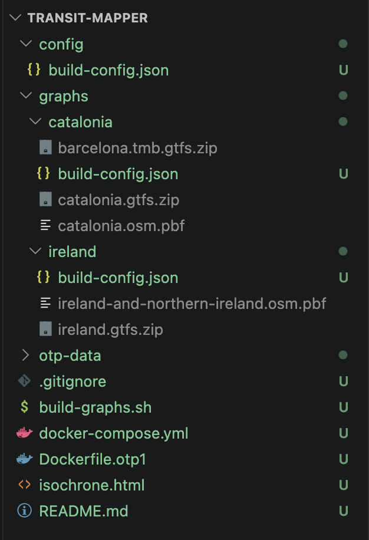

# Transit Mapper

This is a small transit mapping and analysis tool, utilizing OpenTripPlanner (OTP) to build and serve transit graphs. I created it out of interest to easily check transit times out of a single location using various parameters. Something similar exists called Mapnificent, but only later did I find that out.

## Project Structure

-   `config/`: Configuration files for building graphs.
-   `graphs/`: Contains geographical data (GTFS, OSM PBF) for different regions, used to build OTP graphs. Each subdirectory represents a region (e.g., `ireland/`).
-   `otp-data/`: Output directory for the built OTP graph (`graph.obj`) and OTP-related configuration files (`otp-config.json`, `router-config.json`).
-   `build-graphs.sh`: A shell script to automate the process of building OTP graphs from the raw data.
-   `docker-compose.yml`: Docker Compose configuration for setting up and running the OTP server.
-   `Dockerfile.otp1`: Dockerfile for building the OTP image.
-   `isochrone.html`: A visualization tool for displaying isochrones or other transit analysis results.

## Getting Started

### 1. Build Transit Graphs

Use the `build-graphs.sh` script to process the raw GTFS and OSM data into OTP-compatible graph files.

-   **Build all regions:**
    ```bash
    ./build-graphs.sh
    ```
-   **Build a specific region (e.g., `ireland`):**
    ```bash
    ./build-graphs.sh catalonia
    ```

    *Note: Ensure that the necessary GTFS and OSM PBF files are present in the `graphs/<region>/` directory and referenced correctly in `graphs/<region>/build-config.json`. This should look something like this:*

    


### 2. Run the OTP Server

Once the graphs are built, you can run the OpenTripPlanner server using Docker Compose.

```bash
docker compose up -d otp-app-service
```

The OTP server will be accessible at `http://localhost:8080`.

-   **Access the OTP API:**
    -   List available routers: `http://localhost:8080/otp/routers`
    -   Plan a trip for a specific region (e.g., `ireland`): `http://localhost:8080/otp/routers/ireland/plan?fromPlace=...&toPlace=...`

### 3. (Optional) Use `isochrone.html`

The `isochrone.html` file is a client-side tool for visualizing isochrones or other data from the OTP server. You can open this file directly in your web browser.
